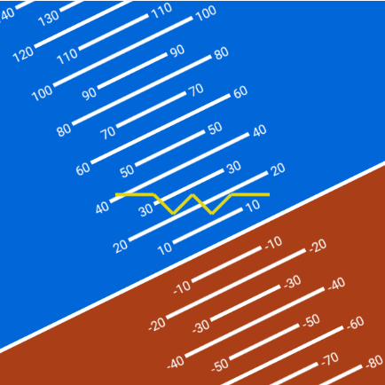
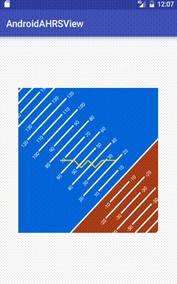

AndroidAHRSView
================

Attitude Heading Reference System(AHRS) display module for Android.



## Demo gif


## How to use it

**1. Add gradle dependency**  
// TODO add this

**2. Add to the layout xml.**

```xml
<me.billhsu.ahrsview.AHRSView
        android:id="@+id/AHRSView"
        android:layout_width="300dp"
        android:layout_height="300dp"/>
```

**3. Use it in your code!**
```java
AHRSView ahrsView = (AHRSView) findViewById(R.id.AHRSView);
ahrsView.setRoll(roll);
ahrsView.setPitch(pitch);
ahrsView.setYaw(yaw);
```

For more details please check the [SampleApp](https://github.com/billhsu/AndroidAHRSView/blob/master/SampleApp/) project.  

##Author
**Shipeng Xu**

+ http://BillHsu.me
+ http://twitter.com/1991bill
+ http://weibo.com/billhsu
